# FangZhangDev's AI Coding Profile



This is a long-term public record of my Claude Code and Codex activity, starting in 2026.

The daily profile is generated from local usage metadata and intentionally excludes prompts, source paths, credentials, raw transcripts, and repository names.

## Project

This project turns local Claude Code and Codex activity into a long-lived, public-safe profile:

- normalized daily usage records suitable for a public Git repository;
- a GitHub contribution-style activity heatmap;
- an SVG profile card that can be embedded in a GitHub profile README;
- an incremental SQLite cache so recurring updates do not reparse unchanged files.

The collector reads local logs but never publishes prompts, source paths, credentials, raw transcripts, or repository names. Only aggregated usage facts are written to `data/daily.jsonl` and `dist/profile.svg`.

## Quick start

```bash
cd /path/to/ai-coding-profile
python3 profile.py update --config config.toml
python3 profile.py validate --config config.toml
```

Copy `config.example.toml` to `config.toml` and adjust paths before the first run. The example uses the paths discovered on the development machine; use absolute paths on a scheduled runner.

Generated files:

- `data/daily.jsonl`: the public append-only daily ledger;
- `dist/profile.svg`: embeddable GitHub profile card;
- `dist/profile.html`: local interactive report;
- `dist/profile.json`: machine-readable summary.

The SQLite cache under `data/` is local-only and ignored by Git. A scheduled job can run the update, commit only the public ledger and SVG, and push to a dedicated public repository.

## Long-term publishing

Run the updater daily from a private machine or scheduled CI job. The public repository should contain the ledger, SVG, README, and workflow files only. Do not put `~/.claude`, `~/.codex`, API keys, or raw session files in that repository.

A minimal daily job is:

```bash
python3 profile.py update --config config.toml
git add data/daily.jsonl dist/profile.svg README.md
git commit -m "chore: update coding activity profile"
git push
```

## Data model

Each daily row includes `date`, `sources`, `models`, `sessions`, `turns`, `input_tokens`, `output_tokens`, `cache_read_tokens`, `cache_write_tokens`, and `total_tokens`. Token fields are reported usage units, not a bill. Cached input is kept separate so the public card can use a less misleading activity metric.
